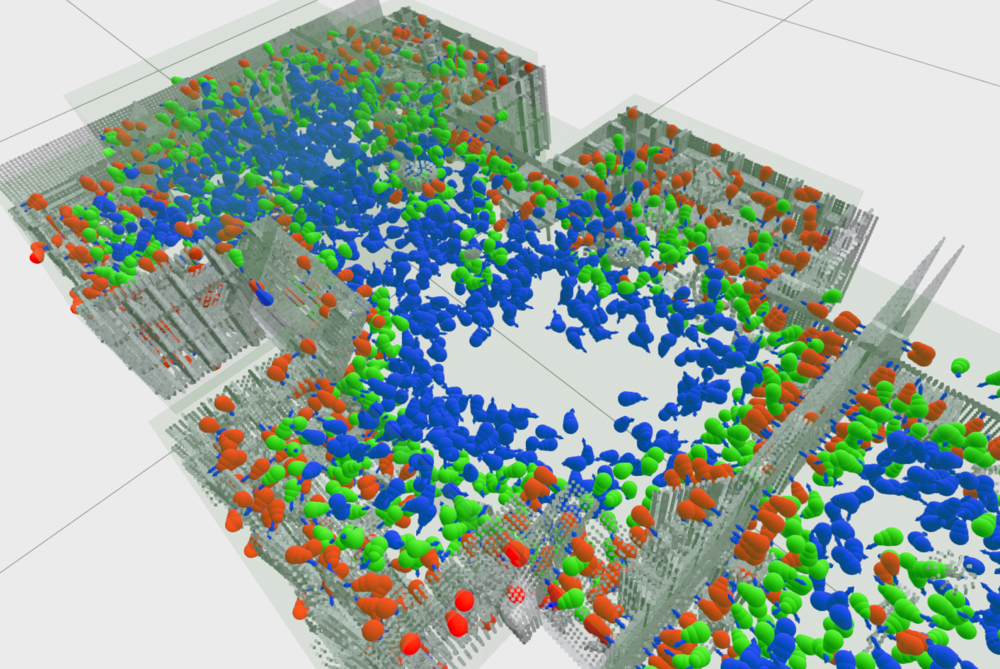
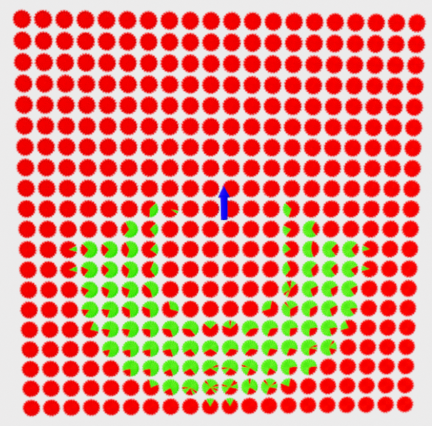
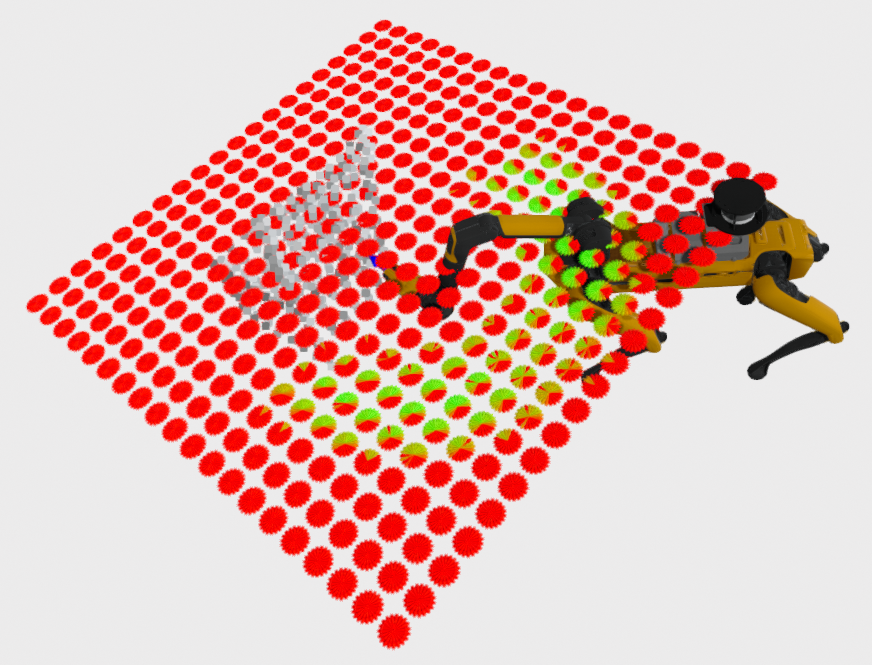

# PlaceNet

**Note:** We're currectly undergoing a rename from BaseNet to PlaceNet due to a name clash with a similar project. If you see any references to BaseNet it's because that particular aspect has not been migrated yet.

### Obstacle Aware Mobile Manipulator Base Placement through Deep Learning

Contents:
 - [Overview](#overview)
 - [Native Installation](#native-installation)
 - [Docker Installation](#docker-installation)
 - [Running](#usage)
   - [Native](#usage)
   - [Docker](#running-with-docker)
 - [Inverse Reachability Map]() [Docs TBD]
 - [ROS2 Server]() [Docs TBD]

## Overview

PlaceNet is a combination of a deep learning model and novel pose selection algorithm intended 
for determining the optimal base pose for a robot to reach a set of task poses in a greedy sense. 
It was designed to be lightweight, portable, and accessible for those with and without large 
compute capabilities and manpower for data collection. The inputs to the model are a single 
pointcloud and a set of task poses for the robot to reach, while the output is a single base pose 
for the robot which reaches the highest number of these tasks the most confidently. Additionally, 
the model outputs a scored list of alternative task poses for optional use with additional criteria.

The PlaceNet model comprises four main parts: 
 - Pointcloud encoding using the [PointNet](https://arxiv.org/abs/1612.00593) architecture 
 - Task pose encoding through a Multi-Layer Perceptron
 - Pose reachability classification through transpose convolution over an SE(2) grid
 - Recursive base pose selection of the classified grid

What PlaceNet does **not** do is sequential base placement optimization. For work involving multiple base placements in series, see related work such as [BaSeNet](https://arxiv.org/abs/2406.08653) which handles such scenarios.

## Native Installation

PlaceNet has been developed and tested in an Ubuntu 22.04 environment. Other Ubuntu and linux distros may provide varying results, and Windows/MacOS are not supported.

The most significant dependency of PlaceNet is the Nvidia [cuRobo](https://curobo.org/) motion 
planning library. This is used for parallelizing IK calculations for ground truth solution 
calculations, as well as for tensorized frame transformation calculations. As a side effect of
this, however, PlaceNet suffers from the same limitations, mainly that CPU-only execution is not
supported. This may be changed in a future version by switching calculations to use the 
[PyTorch3D](https://pytorch3d.readthedocs.io/en/latest/index.html) library which would allow CPU
only deployment, if not training.

We defer to the official [Installation Guide](https://curobo.org/get_started/1_install_instructions.html#library-installation) for setting up cuRobo. 

Once cuRobo is succesfully installed, base net comes packaged with its own setup script for use
with pip.

```bash
git clone https://github.com/alexnavtt/place_net.git
cd base_net
pip install -e .
```

And that's it! Make sure to set up your favorite virtual environment manager if you wish to keep PlaceNet isolated from your system packages.

Optionally, PlaceNet also supports integration with ROS2 for package path resolution. See the [ROS2 installation guide](https://docs.ros.org/en/humble/Installation.html) for setup details. PlaceNet has been tested with ROS2 humble, but more recent versions will also likely work. 

## Docker Installation

PlaceNet also comes with a docker compose build setup for the simplest installation. There are two separate Dockerfiles due to the docker requirements of cuRobo being somewhat difficult to get around. The first simply creates a cuRobo docker image, which requires that the nvidia contianer runtime be the default setting, and that Docker Buildkit be disabled. If either of those two conditions are not met, cuRobo will not be able to scan your GPU hardware during installation.

**Step 1 - Install docker**\
Refer to the [official install guide](https://docs.docker.com/engine/install/) for setup

**Step 2 - Install NVIDIA Container Toolkit**\
Refer to the [official install guide](https://docs.nvidia.com/datacenter/cloud-native/container-toolkit/latest/install-guide.html) for setup.

**Step 3 - Set nvidia as your default docker runtime**
Edit your `/etc/docker/daemon.json` file to include the line `"default-runtime": "nvidia"`. After this step, the file should look similar to
```yaml
{
    "runtimes": {
        "nvidia": {
            "args": [],
            "path": "nvidia-container-runtime"
        }
    },
    "default-runtime": "nvidia"
}
```

Restart the docker daemon, though keep in mind that this will interrupt any other docker containers that you might already have running. Make sure to check with others if you are using a shared machine.

```bash
sudo systemctl restart docker
```

If you do not have admin privileges, you can instead reboot the system.

**Step 4 - Build the cuRobo docker image**
```bash
cd base_net/docker
DOCKER_BUILDKIT=0 docker compose -f curobo-docker-compose.yaml build
```

**Step 5 - Build the main PlaceNet docker image**
```bash
docker compose build
```

## Usage

PlaceNet runs with a single configuration YAML file which covers settings for:
  - Data Paths
  - IK Solver Settings
  - Pointcloud preprocessing
  - Task Geometry
  - Task Generation
  - Inverse Reachability Map generation (optional)
  - PlaceNet model settings

See the [config file](base_net/base_net/samples/config.yaml) in the sample directory for details on the available options. Once the config file is appropriately filled out and all the supporting files are placed in the respective directories (pointclouds, URDF, cuRobo config, etc.), the first step is to generate task poses within each pointcloud. 

#### Task Pose Generation

```bash
base_net generate-task-poses --config-file <path/to/your/config.yaml>
```

If you have visualize set to True in your config file, you should see an output similar to this one



where the diffirent colord spheres represent the end effector collision geometry for your different task generation sets. Task poses are saved immediately upon closing the preview so if you wish to discard the result you have to terminate the program. Alternatively, if you want to generated task poses without saving them for testing purposes, you can comment out or remove the `task_data_path` entry from your config file. 

#### Ground Truth Calculation

Once the task poses are generated, you can set up the ground truth calculations. Even with a powerful GPU, this process involves solving millions of IK problems with full pointcloud collision checking, a very expensive operation. This may take a few days to compute, but once that's done this step never has to be repeated. Additionally, due to the modular nature in which the pointclouds are considered, if you add a new pointcloud later down the line you can calculate task poses and solutions for that pointcloud in isolation, eliminating the need to rerun expensive calculations. 

```bash
base_net calculate-ground-truth --config-file <path/to/your/config.yaml>
```

If you have the debug flag enabled, you will see two outputs for every task pose. The first is a solution to the IK problem with only self collisions enabled. This helps to reduce the number of IK problems to run with the full pointcloud. The second is the final solution with the full collision environment as well as the robot model placed at the highest scoring IK pose. This is usually a good place to verify that everything is working correctly.




#### Training
Finally, it's time to train the model. Once you're happy with your settings in the config file, simply run the command

```bash
base_net train --config-file <path/to/your/config.yaml>
```

Training will begin after a short setup period, and progress can be tracked using tensorboard in the log directory specified in your config file.

### Running with Docker

The main 4 steps - set up the config, generate task poses, calculate ground truth, and train model - are the same when running with docker. The docker compose is set up to mount the entire place_net directory when started, so any changes you make to files inside the repop structure - including pointclouds, config, tasks, and solutions - will be reflected in the docker container. The commands are slightly different and depends on the `BASE_NET_CONFIG` environment variable to indicate where within the base_net repo to look for your config file.

```bash
docker compose run --rm generate_task_poses
docker compose run --rm calculate_ground_truth
docker compose run --rm train_model
```

## Running with ROS
